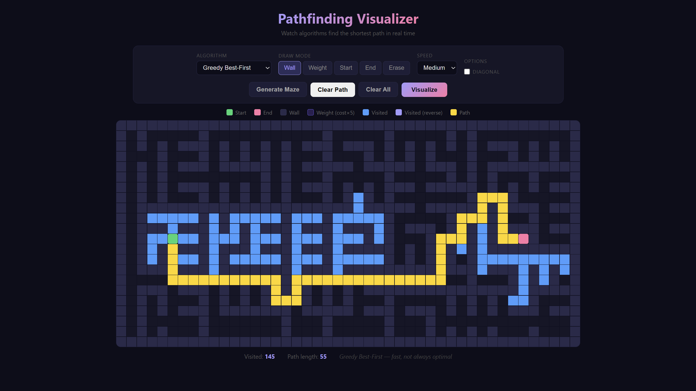

# Pathfinding Visualizer

An interactive visualizer for classic pathfinding algorithms. Draw walls, set start and end points, generate mazes, and watch the algorithms find the shortest path in real time.



## Features

- **4 algorithms** — A*, Dijkstra's, Breadth-First Search, Depth-First Search
- **Draw mode** — click and drag to draw/erase walls, set start and end positions
- **Maze generator** — instant recursive-division maze with one click
- **Color-coded animation** — visited nodes (blue) and the final path (gold) animate step by step
- **Speed control** — Slow, Medium, Fast, or Instant
- **Stats** — visited node count and final path length

## Algorithms

| Algorithm | Weighted | Guarantees Shortest Path |
|-----------|----------|--------------------------|
| A* Search | Yes | Yes |
| Dijkstra's | Yes | Yes |
| BFS | No | Yes (unweighted) |
| DFS | No | No |

## How to Use

1. **Draw walls** — click and drag on the grid
2. **Move start/end** — select Start or End mode then click a cell
3. **Generate a maze** — click "Generate Maze"
4. **Run** — pick an algorithm and click "Visualize"
5. **Clear** — reset the grid and try again

## How to Run

Open `index.html` directly in any modern browser — no installation needed.

```bash
python -m http.server 3000
# then open http://localhost:3000
```

## Tech Stack

- HTML5
- CSS3 (grid layout, keyframe animations)
- Vanilla JavaScript (min-heap priority queue, recursive division)

## Topics

`javascript` `pathfinding` `a-star` `dijkstra` `algorithm-visualizer` `bfs` `dfs` `maze-generation`
